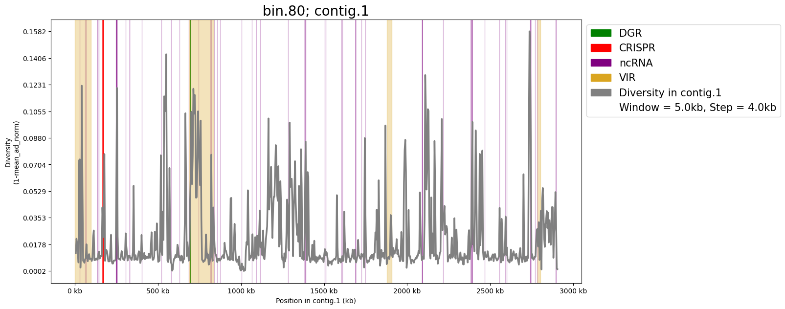

# Usage Tutorial

The CheckD pipeline is broken down into 4 main sections: mapping reads to MAGs, region detection, stats generation, and sliding window plots. The user has the option to run the pipeline from beginning to end in one go by using the "all" flag, as demonstrated with the test run examples.

## Step 1: Map Reads to MAGs

In this step, reads that were used to assembly MAGs in the cohort are mapped back to their MAGs using minimap2. Once mapping is complete, Bcftools is used to generate a VCF file. The allelic depth ("AD") produced in the VCF file is later used to generate diversity scores. 


Illumina:

```
python3 <path_to>/CheckD/scripts/checkd.py \
	map \
        -basename healthy_human_gut \
        -output_dir <path_to_output> \
        -mag_dir <path_to_mags> \
        -illumina_forward_reads <path_to_reads1.fastq> \
        -illumina_reverse_reads <path_to_reads2.fastq> \
        -threads 8
```

PacBio HiFi:

```
python3 <path_to>/CheckD/scripts/checkd.py \
	map \
        -basename lake_griffy_soil \
        -output_dir <path_to_output> \
        -mag_dir <path_to_mags> \
        -hifi_reads <path_to_hifi_reads.fastq> \
        -threads 8
```


## Step 2: Region Detection

CheckD identifies Coding Domain Sequences (CDS) using FragGeneScan, CRISPR artifacts using CRISPRone, Diversity Generating Retroelements (DGRs) using myDGR, viral DNA using VirSorter2, and non-coding RNA (ncRNA) using Rfam. 

Illumina:

```
python3 <path_to>/CheckD/scripts/checkd.py \
	region \
        -basename healthy_human_gut \
        -output_dir <path_to_output> \
        -mag_dir <path_to_mags> \
        -illumina_forward_reads <path_to_reads1.fastq> \
        -illumina_reverse_reads <path_to_reads2.fastq> \
        -threads 8
```

PacBio HiFi:

```
python3 <path_to>/CheckD/scripts/checkd.py \
	region \
        -basename lake_griffy_soil \
        -output_dir <path_to_output> \
        -mag_dir <path_to_mags> \
        -hifi_reads <path_to_hifi_reads.fastq> \
        -threads 8
```

## Step 3: Calculate Diversity Stats

Once the region detection is complete, CheckD produces diversity summary stats for all regions within and across MAGs of a cohort. 

Illumina:

```
python3 <path_to>/CheckD/scripts/checkd.py \
	stats \
        -basename healthy_human_gut \
        -output_dir <path_to_output> \
        -mag_dir <path_to_mags> \
        -illumina_forward_reads <path_to_reads1.fastq> \
        -illumina_reverse_reads <path_to_reads2.fastq> \
        -threads 8
```

PacBio HiFi:

```
python3 <path_to>/CheckD/scripts/checkd.py \
	stats \
        -basename lake_griffy_soil \
        -output_dir <path_to_output> \
        -mag_dir <path_to_mags> \
        -hifi_reads <path_to_hifi_reads.fastq> \
        -threads 8
```

## Step 4: Plot Diversity and Regions

CheckD produces sliding window plots for all MAGs to show diversity across regions. 

Illumina:

```
python3 <path_to>/CheckD/scripts/checkd.py \
	sliding_window_plot \
        -basename healthy_human_gut \
        -output_dir <path_to_output> \
        -mag_dir <path_to_mags> \
        -illumina_forward_reads <path_to_reads1.fastq> \
        -illumina_reverse_reads <path_to_reads2.fastq> \
        -threads 8 \
	-window <window_size> \
	-step <step_size>
```

PacBio HiFi:

```
python3 <path_to>/CheckD/scripts/checkd.py \
	sliding_window_plot \
        -basename lake_griffy_soil \
        -output_dir <path_to_output> \
        -mag_dir <path_to_mags> \
        -hifi_reads <path_to_hifi_reads.fastq> \
        -threads 8 \
	-window <window_size> \
	-step <step_size>
```





